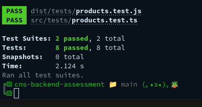
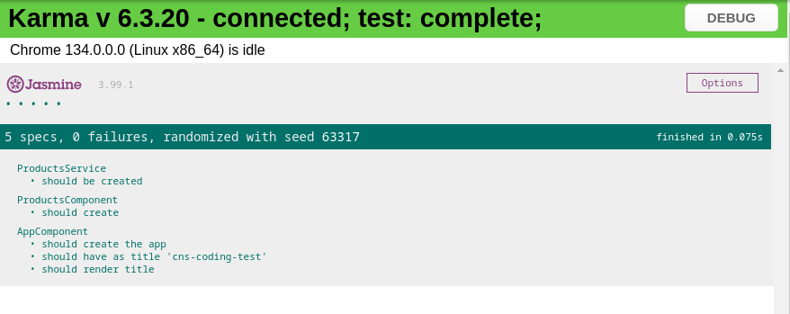

# CNS

## Backend

inside the `cns-backend-assessment` folder, run the command:

```bash
npm run start
```

This will start a server on port 3000 by default and the frontend will access it through
the anguar proxy setup inside `cns-frontend-assessment/proxy.config.json`

## Frontend

inside the `cns-frontend-assessment` folder, run the command:

```bash
npm run start
```

inside the browser go to the url https://localhost:4200/ to see the angular application
calls the api will be sent to `https://localhost:4200/api/*` and directed to  `https://localhost:3000/*` using the anguar proxy setup inside `cns-frontend-assessment/proxy.config.json`


## Tests

### Backend 



### Frontend 

